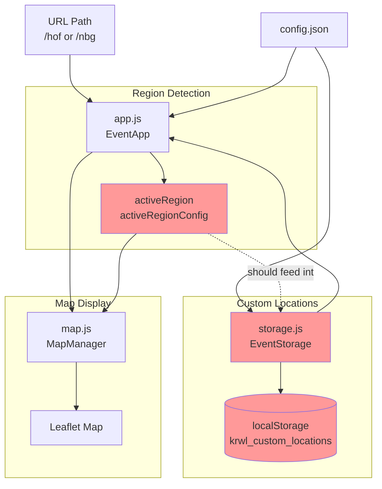

# Custom Location Region-Specific Feature Analysis

**Date:** 2024
**Issue:** Custom locations are always set for Hof region, but each region should have its own custom locations that load when the map centers on that region.

---

## Problem Statement

The current implementation stores custom locations in `localStorage` globally (key: `krwl_custom_locations`), but initializes them **only from the global `config.map.predefined_locations`** which contains Antarctica demo data:

```json
"map": {
  "predefined_locations": [
    {
      "name": "location.no1",
      "lat": -89.999,
      "lon": 45.0,
      "display_name": "🐧 Penguin HQ"
    },
    {
      "name": "location.no2",
      "lat": -89.998,
      "lon": -90.0,
      "display_name": "🧊 Ice Cube Bar"
    }
  ]
}
```

**What Should Happen:**
- When user visits `/hof`, they see custom locations for Hof region
- When user visits `/nbg`, they see custom locations for Nuremberg region
- Each region has its own set of predefined custom locations

**Current Behavior:**
- All regions share the same global `predefined_locations` (Antarctica demo data)
- Once initialized, custom locations persist across all regions
- No region-specific custom location support

---

## Architecture Analysis

### 1. Modules Handling Custom Locations

#### **Primary Module: `assets/js/storage.js`** (EventStorage class)

**Key Methods:**
- `initializeDefaultCustomLocations()` - Lines 29-55
  - Called in constructor (line 22)
  - Reads from `this.config?.map?.predefined_locations`
  - **Problem:** Only looks at global map.predefined_locations, not region-specific
  
- `loadCustomLocations()` - Lines 238-250
  - Loads from `localStorage.getItem('krwl_custom_locations')`
  - **Problem:** Single global key, not region-aware
  
- `saveCustomLocations()` - Lines 255-263
  - Saves to `localStorage.setItem('krwl_custom_locations', ...)`
  - **Problem:** Single global key, not region-aware

**Dependencies:**
- Depends on: `config.json` (map.predefined_locations)
- Used by: `app.js` (EventStorage instance)

**Files:** 
- `assets/js/storage.js`

---

#### **Secondary Module: `assets/js/app.js`** (EventApp class)

**Key Methods:**
- `applyRegionFromUrl()` - Lines 105-181
  - Detects region from URL path (e.g., `/hof`, `/nbg`)
  - Sets `this.activeRegion` and `this.activeRegionConfig`
  - Applies region-specific map center and zoom
  - **Does NOT** apply region-specific custom locations
  
- `filterEventsByRegion()` - Lines 404-445
  - Filters events based on active region
  - Shows antarctica/atlantis demo events for showcase regions
  - Shows real events for production regions

**Dependencies:**
- Depends on: `config.json` (regions object), `storage.js`
- Used by: All UI components

**Files:**
- `assets/js/app.js`

---

### 2. Modules Handling Regions and Map Centering

#### **Primary Module: `assets/js/app.js`** (Region Detection)

**How Region Detection Works:**

1. **URL Path Parsing** (`applyRegionFromUrl()`)
   ```javascript
   // Extracts region from URL: krwl.in/hof → 'hof'
   const segments = path.split('/').filter(Boolean);
   const regionId = segments[segments.length - 1].toLowerCase();
   ```

2. **Region Lookup in Config**
   ```javascript
   const regions = this.config.regions || {};
   const region = regions[regionId];  // Gets region-specific config
   ```

3. **Apply Region Settings**
   ```javascript
   // Sets map center
   this.config.map.default_center = {
       lat: region.center.lat,
       lon: region.center.lng
   };
   
   // Stores active region
   this.activeRegion = regionId;          // e.g., 'hof'
   this.activeRegionConfig = region;      // Full region object
   ```

**Region-Specific Data Available:**
Each region in `config.json` has:
- `center` - Map center coordinates
- `zoom` - Default zoom level
- `boundingBox` - Geographic boundaries
- `customFilters` - Region-specific location presets (NOT USED FOR CUSTOM LOCATIONS!)

---

#### **Secondary Module: `assets/js/map.js`** (MapManager class)

**Key Methods:**
- `initMap()` - Lines 58-90
  - Initializes Leaflet map
  - Uses `this.config.map.default_center` (set by region detection)
  - Centers map on region-specific coordinates

- `centerMap(lat, lon, marker, distance)` - Not shown but referenced
  - Centers map on specific coordinates
  - Used when user selects custom location

**Dependencies:**
- Depends on: `config.json` (map settings), Leaflet.js
- Used by: `app.js`

**Files:**
- `assets/js/map.js`

---

### 3. Current Region-Specific Features (Working Examples)

The project **ALREADY** supports region-specific configuration for some features:

#### ✅ **customFilters** (Region-specific location presets)

**Hof Region:**
```json
"customFilters": [
  {
    "id": "innenstadt",
    "name": { "de": "Innenstadt", "en": "City Center" },
    "center": { "lat": 50.3197, "lng": 11.9177 },
    "radius": 1.5,
    "zoom": 14
  },
  {
    "id": "altstadt",
    "name": { "de": "Altstadt", "en": "Old Town" },
    "center": { "lat": 50.3220, "lng": 11.9150 },
    "radius": 1.0,
    "zoom": 15
  }
]
```

**Nuremberg Region:**
```json
"customFilters": [
  {
    "id": "altstadt",
    "name": { "de": "Altstadt", "en": "Old Town" },
    "center": { "lat": 49.4541, "lng": 11.0767 },
    "radius": 1.2,
    "zoom": 14
  },
  {
    "id": "gostenhof",
    "name": { "de": "Gostenhof", "en": "Gostenhof" },
    "center": { "lat": 49.4580, "lng": 11.0580 },
    "radius": 1.0,
    "zoom": 15
  }
]
```

**⚠️ However:** `customFilters` are NOT currently used to initialize custom locations! They are separate features.

---

## Dependency Diagram



**Legend:**
- 🔴 Red = Modules that need modification
- → Solid line = Current data flow
- -.-> Dotted line = Missing connection (needs implementation)

---

## Dependencies Between Features

From `features.json`:

### **custom-location** Feature
```json
{
  "id": "custom-location",
  "name": "Custom Location Override with localStorage Persistence",
  "depends_on": [
    "interactive-map",
    "geolocation-filtering"
  ],
  "used_by": [],
  "breaks_if_missing": [
    "Users cannot override geolocation",
    "Privacy-conscious users stuck with browser location",
    "Cannot manually set preferred location"
  ]
}
```

### **interactive-map** Feature
```json
{
  "id": "interactive-map",
  "name": "Interactive Map",
  "depends_on": [],
  "used_by": [
    "geolocation-filtering",
    "custom-location",
    "map-markers"
  ]
}
```

---

## Solution Design

### Strategy: Make Custom Locations Region-Aware

#### Option 1: Store Per-Region Custom Locations (RECOMMENDED)

**Change localStorage structure:**

**Before:**
```javascript
localStorage.setItem('krwl_custom_locations', JSON.stringify([...]))
```

**After:**
```javascript
localStorage.setItem('krwl_custom_locations', JSON.stringify({
  hof: [...],
  nbg: [...],
  antarctica: [...]
}))
```

**Pros:**
- Preserves user customizations per region
- No data loss when switching regions
- Supports independent custom locations per region

**Cons:**
- Slightly more complex localStorage structure
- Requires migration of existing data

---

#### Option 2: Use Region's `customFilters` as Predefined Locations (SIMPLER)

**Change initialization to use region-specific customFilters:**

**Before:**
```javascript
const predefinedLocs = this.config?.map?.predefined_locations || [];
```

**After:**
```javascript
const predefinedLocs = this.app.activeRegionConfig?.customFilters || 
                       this.config?.map?.predefined_locations || [];
```

**Pros:**
- Simpler implementation
- Reuses existing region configuration
- Each region already has `customFilters` defined

**Cons:**
- User custom locations still shared across regions (unless combined with Option 1)
- Requires careful handling of data structure differences

---

### Required File Changes

#### 1. **assets/js/storage.js** (HIGH PRIORITY)

**Lines to modify:**

**Constructor (Line 18):**
```javascript
// BEFORE
this.customLocations = this.loadCustomLocations();

// AFTER
this.customLocations = this.loadCustomLocations(this.app.activeRegion);
```

**initializeDefaultCustomLocations() (Lines 29-55):**
```javascript
// BEFORE
const predefinedLocs = this.config?.map?.predefined_locations || [];

// AFTER
// Use region-specific customFilters
const regionConfig = this.app.activeRegionConfig;
const predefinedLocs = regionConfig?.customFilters || 
                       this.config?.map?.predefined_locations || [];

// Note: customFilters have different structure, so need to adapt:
predefinedLocs.forEach((loc) => {
    this.customLocations.push({
        id: `custom_${loc.id}_${Date.now()}`,
        name: loc.name.de || loc.name.en || loc.display_name,  // Handle i18n
        lat: loc.center.lat,  // customFilters use 'center' object
        lon: loc.center.lng || loc.center.lon,
        created: new Date().toISOString(),
        fromPredefined: true
    });
});
```

**loadCustomLocations() (Lines 238-250):**
```javascript
// BEFORE
loadCustomLocations() {
    const locationsData = localStorage.getItem('krwl_custom_locations');
    // ...
}

// AFTER
loadCustomLocations(regionId) {
    const allLocations = localStorage.getItem('krwl_custom_locations');
    if (allLocations) {
        const parsed = JSON.parse(allLocations);
        
        // Support both old (array) and new (object) formats
        if (Array.isArray(parsed)) {
            return parsed;  // Old format - global
        } else {
            return parsed[regionId] || [];  // New format - per-region
        }
    }
    return [];
}
```

**saveCustomLocations() (Lines 255-263):**
```javascript
// BEFORE
saveCustomLocations() {
    const locationsData = JSON.stringify(this.customLocations);
    localStorage.setItem('krwl_custom_locations', locationsData);
}

// AFTER
saveCustomLocations() {
    const regionId = this.app.activeRegion || 'hof';
    
    // Load existing data
    let allLocations = {};
    try {
        const existing = localStorage.getItem('krwl_custom_locations');
        if (existing) {
            const parsed = JSON.parse(existing);
            if (!Array.isArray(parsed)) {
                allLocations = parsed;
            }
        }
    } catch (e) {
        console.warn('Failed to load existing custom locations:', e);
    }
    
    // Update this region's locations
    allLocations[regionId] = this.customLocations;
    
    // Save back
    localStorage.setItem('krwl_custom_locations', JSON.stringify(allLocations));
}
```

---

#### 2. **assets/js/app.js** (MEDIUM PRIORITY)

**applyRegionFromUrl() (Lines 105-181):**

Add after region is detected and stored:

```javascript
// Line ~180, after:
this.activeRegion = regionId;
this.activeRegionConfig = region;

// ADD THIS:
// Reload custom locations for this region
if (this.storage) {
    this.storage.customLocations = this.storage.loadCustomLocations(regionId);
    this.storage.initializeDefaultCustomLocations();
}
```

---

#### 3. **config.json** (LOW PRIORITY - OPTIONAL)

Consider moving Antarctica's predefined locations to its region config:

**BEFORE:**
```json
{
  "map": {
    "predefined_locations": [
      { "name": "location.no1", "lat": -89.999, ... }
    ]
  },
  "regions": {
    "antarctica": { ... }
  }
}
```

**AFTER:**
```json
{
  "map": {
    "predefined_locations": []  // Remove global predefined locations
  },
  "regions": {
    "antarctica": {
      "customFilters": [
        {
          "id": "penguin_hq",
          "name": { "de": "🐧 Pinguin-Zentrale", "en": "🐧 Penguin HQ" },
          "center": { "lat": -89.999, "lng": 45.0 },
          "radius": 0.5,
          "zoom": 8
        },
        {
          "id": "ice_cube_bar",
          "name": { "de": "🧊 Eiswürfel-Bar", "en": "🧊 Ice Cube Bar" },
          "center": { "lat": -89.998, "lng": -90.0 },
          "radius": 0.5,
          "zoom": 8
        }
      ]
    }
  }
}
```

**Note:** Antarctica ALREADY has `customFilters` defined! We just need to use them.

---

## Testing Strategy

### Test Cases

1. **Region Initialization**
   - Visit `/hof` → Should see Hof custom locations (Innenstadt, Altstadt, Theresienstein)
   - Visit `/nbg` → Should see Nuremberg custom locations (Altstadt, Gostenhof, Südstadt)
   - Visit `/antarctica` → Should see Antarctica demo locations (Penguin HQ, Ice Cube Bar)

2. **Custom Location Persistence**
   - Add custom location in `/hof`
   - Switch to `/nbg`
   - Switch back to `/hof` → Custom location should still exist

3. **User-Added Locations**
   - Add a new custom location in `/hof`
   - Verify it appears in dashboard
   - Switch to `/nbg` and add different location
   - Switch back to `/hof` → Should see original custom location, not `/nbg` location

4. **Migration from Old Format**
   - User has existing `krwl_custom_locations` as array
   - Load page → Should still work (backward compatibility)
   - Add new custom location → Should convert to new format

### Test Commands

```bash
# Manual testing
# 1. Open browser console
# 2. Check localStorage
localStorage.getItem('krwl_custom_locations')

# 3. Navigate between regions
# /hof
# /nbg
# /antarctica

# 4. Verify custom locations change per region
```

---

## Impact Analysis

### Features That Break If Not Implemented Correctly

From `features.json` dependency analysis:

1. **custom-location** (direct impact)
   - Users cannot set region-appropriate custom locations
   - Seeing Antarctica locations in Hof/Nuremberg is confusing

2. **geolocation-filtering** (indirect impact via custom-location)
   - If custom locations are wrong region, distance filters will be inaccurate
   - User might filter events thinking they're near Hof when actually near Antarctica coordinates

3. **interactive-map** (visual impact)
   - Map might center on correct region but custom location dropdown shows wrong region's locations

### Estimated Complexity

**Small Change, Big Impact:**
- **Files to modify:** 2 main files (storage.js, app.js)
- **Lines of code:** ~50 lines changed
- **Risk:** Low (mostly additive changes, backward compatible)
- **Testing effort:** Medium (need to test all regions)

---

## Implementation Checklist

- [ ] **Step 1:** Modify `storage.js` to support region-aware localStorage
  - [ ] Update `loadCustomLocations()` to accept `regionId` parameter
  - [ ] Update `saveCustomLocations()` to save per-region data
  - [ ] Add backward compatibility for old array format
  
- [ ] **Step 2:** Update `storage.js` initialization
  - [ ] Modify `initializeDefaultCustomLocations()` to use `activeRegionConfig.customFilters`
  - [ ] Handle data structure differences (customFilters vs predefined_locations)
  - [ ] Support i18n for location names (de/en)

- [ ] **Step 3:** Connect region detection to storage
  - [ ] Update `app.js` to reload custom locations on region change
  - [ ] Pass `activeRegion` to storage methods

- [ ] **Step 4:** Test all regions
  - [ ] Test `/hof` custom locations
  - [ ] Test `/nbg` custom locations
  - [ ] Test `/antarctica` custom locations
  - [ ] Test custom location persistence across region switches

- [ ] **Step 5:** Update documentation
  - [ ] Update `features.json` to document region-specific behavior
  - [ ] Update `MULTI_REGION_INFRASTRUCTURE.md` if it exists
  - [ ] Add note to `.github/copilot-instructions.md`

---

## Related Documentation

- **features.json** - Feature registry (custom-location, interactive-map)
- **docs/architecture.md** - System architecture overview
- **docs/MULTI_REGION_INFRASTRUCTURE.md** - Multi-region setup guide
- **config.json** - Region configuration (customFilters per region)
- **.github/copilot-instructions.md** - Project conventions
- **.github/agents/complexity-manager.md** - This agent's guide

---

## Questions for Discussion

1. **Should user-added custom locations be shared across regions or kept separate?**
   - Separate = User can have "Home" in both Hof and Nuremberg
   - Shared = "Home" location is global, might be confusing

2. **Should we migrate old localStorage data automatically or require user action?**
   - Automatic = Better UX, but might cause confusion if user switches regions frequently
   - Manual = User explicitly chooses which region to keep old locations in

3. **Should `customFilters` be renamed to `predefinedLocations` for consistency?**
   - Pro: More intuitive naming
   - Con: Breaking change for existing configs

---

## Success Metrics

✅ Implementation is successful when:
- [ ] Each region shows its own set of predefined custom locations
- [ ] User-added custom locations persist per region
- [ ] Switching between regions loads correct custom locations
- [ ] Old localStorage format is migrated automatically
- [ ] No console errors or warnings
- [ ] All test cases pass

---

**Next Steps:**
1. Review this analysis with team
2. Decide on implementation approach (Option 1 vs Option 2)
3. Create implementation plan in `docs/plans/`
4. Implement changes
5. Test thoroughly across all regions
6. Update features.json and documentation
